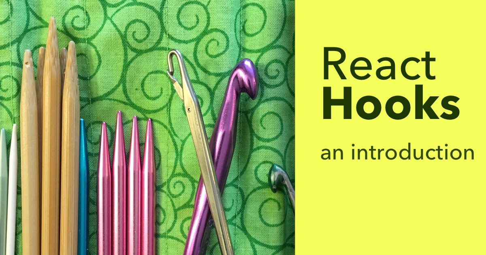

<picture>
  <source
    type="image/webp"
    srcset="images/a7ec263e07e4a22b21dbf863b9358175201ecb66208becf72929940c523bf80a_hooks-intro@2x.webp 2x" />

  <source
    type="image/webp"
    srcset="images/c2ea3a9618ae8a665223888de16a73deaa035deb8986a370dfe3ab1371afca9b_hooks-intro.webp" />


</picture>

You know how React class components can hold state, and function components can’t?

And how class components can have lifecycles, and function components can’t?

And how class components can extend `PureComponent`, but function components are stuck rendering every single time?

Well – hooks change all that (and technically that last one is solved by the new `React.memo` function in 16.6).

Hooks, officially released as part of React 16.8, make it possible to take a React function component and add state to it, or _hook into_ lifecycle methods like `componentDidMount` and `componentDidUpdate` (see what I did there).

From here on out, if you write a function component, and later decide that it needs a bit of state, you don’t have to refactor the whole thing into a class. Those functions are no longer relegated to being “stateless function components”.

## What About Classes? I like classes!

Hooks don’t replace classes. They’re just a new tool that you can use, if you want to.

The React team has said that they’ve got no plans to deprecate classes in React, so if you want to keep using them, please do!

I know how much of a pain it is to feel like there’s always something new to learn… like you’re always falling behind. (I definitely feel it myself, writing this blog!) I’m treating hooks as a nice new feature to use when I need them, and not like the New Best Way. I’m not planning to go back and rewrite old code to use hooks, and the React team is recommending against that as well.

## A Familiar Start

Let’s see an example of one of these hooks at work. We’ll start with something we already know: a plain function component.

It doesn’t really live up to its name of `OneTimeButton` yet – all it does is call the `onClick` function when you click it. We’ll take care of that in a minute.

```
import React from 'react';
import { render } from 'react-dom';

function OneTimeButton(props) {
  return (
    <button onClick={props.onClick}>
      You Can Only Click Me Once
    </button>
  );
}

function sayHi() {
  console.log('yo');
}

render(
  <OneTimeButton onClick={sayHi}/>,
  document.querySelector('#root')
);
```

What we _want_ this component to do, is keep track of whether be it’s been clicked – and if it has, disable the button. Like a one-time switch, of sorts.

But it needs state. It’s a function. It can’t have state. Maybe it’s time to convert it into a class.

Thus begins the 5 stages of Converting a Function to a Class:

1.  **Denial**. Maybe it doesn’t really need to be a class. Maybe I could put the state somewhere else.
2.  **Realization**. Crap, I have to make it into a class, don’t I?
3.  **Acceptance**. ooookkk FINE I’ll convert it.
4.  **Hard Work**. Write out `class Thing extends React.Component`. Copy-paste the function body into `render`. Eh crap, now the indentation is wrong. Select it all, Tab Tab Tab Shift-Tab. After all that the component _still does the exact same thing_ (if you’re lucky, anyway).
5.  **Finally, add the state**. If only this were step 1.

So here we go, let’s convert the function into a class:

```
class OneTimeButton extends React.Component {
  // initialize the state...
  state = {
    clicked: false
  }

  // make a click handler
  handleClick = () => {
    // The handler won't be called if the button
    // is disabled, so if we got here, it's safe
    // to trigger the click.
    this.props.onClick();

    // Ok, no more clicking.
    this.setState({ clicked: true });
  }

  render() {
    return (
      <button
        onClick={this.handleClick}
        disabled={this.state.clicked}
      >
        You Can Only Click Me Once
      </button>
    );
  }
}
```

It’s quite a bit more code, and it’s a big change to the component’s structure. Lots of little changes and rearranging to do. And it’s using some shorthand like class properties that are still not officially part of JavaScript (but are supported by Babel plugins).

## Or: Easily Add State With a Hook

Now, let’s see how we can use the new `useState` hook to add state to the plain function component:

```
// we need to import the `useState` hook:
// (or write React.useState)
import React, { useState } from 'react';

function OneTimeButton(props) {
  // Create a new piece of state.
  // It comes with its own updater function!
  const [clicked, setClicked] = useState(false);

  // We need to handle button clicks by
  // calling out to the callback prop and then
  // turning the button off
  function doClick() {
    props.onClick();
    setClicked(true);
  }

  // This part is pretty much the same, but a little
  // less cluttered without `this`
  return (
    <button
      onClick={clicked ? undefined : doClick}
      disabled={clicked}
    >
      You Can Only Click Me Once
    </button>
  );
}
```

### How This Code Works

Most of this code looks like the plain function component we wrote a minute ago, except that `useState` thing.

`useState` is a _hook_. You can tell because its name starts with “use” (that’s one of the [Rules of Hooks][1] – their names must start with “use”).

Success! Now check your email.

The `useState` hook takes the initial state as an argument (we passed `false`) and it returns an array with 2 elements: the current state, and a function to change the state.

Class components have one big state object, and a function `this.setState` to change the whole thing at once (plus it shallow-merges the new value).

Function components come with no state at all, but the `useState` hook allows us to add little nuggets of state as we need them. So if all we need is a single boolean, we can create a bit of state to hold that.

Since we’re creating these pieces of state in a sort of ad-hoc way, and there’s no component-wide `setState` function, it makes sense that we’d need a function for updating each piece of state. So it’s a pair: one value, one function. The value can be anything, of course – any JS type – a number, boolean, object, array, etc.

Now I bet you have a lot of questions. Things like…

- When the component re-renders… won’t the state get re-created every time? How does React know what the old state was?
- Why do hook names have to start with “use”? That seems fishy.
- If there’s a rule about naming… does that mean I can make my own hooks?
- How can I store more complex state? I have to keep track of more than one value, you know!
- HOW CAN I USE THE HOOKS RIGHT NOW JSUT TELL ME

Let’s talk about those.

## Where Can I Get Hooked?

Sorry. The puns, I know. I can’t help it.

Hooks are officially part of React as of 16.8. So if you’re using React 16.8 or higher, you’re good to go.

Any new projects created with Create React App will have the latest version of React, and so will have hooks included.

## The “Magic” of Hooks

Ahh, the weird paradox of storing stateful information in a seemingly-stateless function component. This was the first question I had about hooks, and I had to figure out how they worked.

My first guess was some sort of compiler trickery. Searching the code for `useWhatever` and replacing it with stateful logic somehow.

And then I heard about the call order rule (they must be called in the same order every time), and that just made me _more_ confused. So here’s how it actually works.

The first time React renders a function component, it creates an object to live alongside it – a bespoke object for that component instance, not a global one. This component’s object survives as long as the component exists in the DOM.

<picture>
  <source
    type="image/webp"
    srcset="images/c86e0a58012b07f87d466e912c91d85afe47e59fc0c016d4f6c8fe00e5b4eb50_stag-patronus.webp" />


</picture>
Photo: Pottermore.com

Using that object, React can keep track of various bits of metadata that belong to a component.

Keep in mind here that React is responsible for _calling_ your component. So it can do some setup beforehand, and that’s when it sets up this ‘state.’

One of the things in there is an _array of hooks_. It starts off empty. Every time you call a hook, React adds an item to that array.

### Why the Call Order Matters

Let’s say we have this component:

```
function AudioPlayer() {
  const [volume, setVolume] = useState(80);
  const [position, setPosition] = useState(0);
  const [isPlaying, setPlaying] = useState(false);

  // < beautiful audio player goes here >
}
```

Since it calls `useState` 3 times, React would put 3 entries in the array of hooks on the first render.

The _next_ time it renders, those same 3 hooks are called in the same order (because code doesn’t magically rewrite itself between calls), so React can look into its array and say “Oh, I already have a `useState` hook in position 0, so instead of creating a new state, I’ll return the existing one.”

That’s how React is able to create and maintain state across multiple function calls, even when the variables themselves go out of scope each time.

### Step-by-step Example of Multiple useState Calls

Let’s look at how this plays out in more detail. Here’s the first render:

1.  React has just created the component. It hasn’t even called the function yet. It creates the metadata object, and the empty array of hooks. Let’s imagine that object has a property called `nextHook` and it’s set to 0. The first hook that runs will consume position 0.
2.  React calls your component (which means it knows which metadata object to store the hooks in).
3.  You call `useState`. React creates a new piece of state, puts it in position 0 of the hooks array, and returns your `[volume, setVolume]` pair with `volume` set to its initial value of `80`. It also increments the `nextHook` index to 1.
4.  You call `useState` again. React looks at position 1 of the array, sees that it’s empty, and creates a new piece of state. Then it increments the `nextHook` index to 2, and returns `[position, setPosition]`.
5.  You call `useState` a third time. React sees that position 2 is unfilled, creates the state, increments `nextHook` to 3, and returns `[isPlaying, setPlaying]`.

Now the array of hooks has 3 items in it, and the render is finished. What happens on the _next_ render?

1.  React needs to re-render the component. Hello, old friend. React has seen this component before, and it already has metadata associated.
2.  React resets the `nextHook` index to 0, and calls your component.
3.  You call `useState`. React looks into its array of hooks at index 0, and sees that it already has a hook in that slot! No need to create one. So it advances `nextHook` to index 1 and returns `[volume, setVolume]` with `volume` still set to 80.
4.  You call `useState` again. This time, `nextHook` is 1, so React checks index 1 of the array – again, a hook already exists, so it increments `nextHook` and returns `[position, setPosition]`.
5.  You call `useState` a third time. I think you know what happens by now.

So that’s it. It’s not magic; but it does rely on a few things being true. This leads to a few Rules of Hooks.

Success! Now check your email.

## Rules of Hooks

It ain’t Fight Club, but we do have some rules to follow:

1.  Only call hooks at the top level of your function. Don’t put them in loops, conditionals, or nested functions. In order for React to keep track of your hooks, the same ones need to be called in the same order every single time.

2.  Only call hooks from React function components, or from custom hooks. Don’t call them from outside a component (what would that even do?). Keeping all the calls inside components and custom hooks makes your code easier to follow too, because all the related logic is grouped together.

3.  The names of hooks must start with “use”. Like `useState` or `useEffect` (well, not those two, those are taken).

The React team created some ESLint rules to catch problematic usage of hooks (install from [here][2]), and the linter needs a way to identify “a hook.” Hence the naming prefix. Nothing magical going on there. The linter will be able to warn you if you violate rule 1 or 2, but only if you follow rule 3 ;)

## Custom Hooks

You might wonder… if there are naming rules, does that mean you can create your own hooks? Unlike those clickbait articles where the answer to the question is always “no” – the answer here is YES, you can create custom hooks!

Custom hooks are just functions that follow rule 3: their name must be prefixed with “use”. After that, you can call hooks inside them. They’re a nice way to roll up a bunch of hooks into one.

We could, for instance, extract the 3 pieces of state from the `AudioPlayer` component into its own custom hook:

```
function AudioPlayer() {
  // Extract these 3 pieces of state:
  const [volume, setVolume] = useState(80);
  const [position, setPosition] = useState(0);
  const [isPlaying, setPlaying] = useState(false);

  // < beautiful audio player goes here >
}
```

So we can create a new function that handles the state and returns an object with some extra methods to make it easier to start and stop playback, for instance:

```
function usePlayerState(lengthOfClip) {
  const [volume, setVolume] = useState(80);
  const [position, setPosition] = useState(0);
  const [isPlaying, setPlaying] = useState(false);

  const stop = () => {
    setPlaying(false);
    setPosition(0);
  }

  const start = () => {
    setPlaying(true);
  }

  return {
    volume,
    position,
    isPlaying,
    setVolume,
    setPosition,
    start,
    stop
  };
}
```

Once nice thing about extracting the state like this is that you can group related logic and behavior together. You can extract a “bundle” of state and related event handlers and other update logic, which not only cleans up your component code, but it also makes these bundles of logic and behavior _reusable_.

Plus you can compose hooks together, by calling custom hooks inside your own custom hooks. Hooks are just functions, and of course, functions can call other functions.

## More Examples of useState

I put together a few more [examples of the `useState` hook][3] at work, showing how to use it with different values, and how you can store and update objects. (hint: it doesn’t work exactly like `this.setState` but it’s close) and how you can store and update objects. (hint: it doesn’t work exactly like `this.setState` but it’s close)

There’s also a [video lesson over there][4] so check that out too.

## Early Days

The Hooks feature was released only a few days ago, and as such, everyone is brand new to them. They offer a new way to approach problems in React, and I think we’re going to see a lot of exciting new ideas (and more than a few custom hooks) over the next few days, weeks, and months.

As with anything brand new, there’s going to be a lot of excitement, but I suspect there’ll also be a heavy dose of anxiety too, and lots of questions.

The React team has put together a great set of [docs][5] and an [FAQ][6] answering questions from “Do I need to rewrite all my class components” to “Are Hooks slow because of creating functions in render?” and everything in between, so definitely check that out.

There’s also an open [RFC (Request for Comments)][7] and the React team is looking for feedback on the Hooks implementation, so leave a comment there if you have suggestions.

And hey, open up a [new CodeSandbox][8] and try playing around with the `useState` hook on your own! Don’t feel like you need to wait around until someone else figures them out. If you learn something awesome, or run into a weird problem, write up your experience and share it! We’ll all get better at hooks together.

Tomorrow I’ll have a new post all about the `useReducer` hook with more in-depth examples and a video. Sign up below to get notified about that and every other post this week.

Success! Now check your email.

[1]: https://daveceddia.com/intro-to-hooks/#rules-of-hooks
[2]: https://reactjs.org/docs/hooks-rules.html#eslint-plugin
[3]: https://daveceddia.com/usestate-hook-examples/
[4]: https://daveceddia.com/usestate-hook-examples/#example-showhide-a-component-with-usestate
[5]: https://reactjs.org/docs/hooks-intro.html
[6]: https://reactjs.org/docs/hooks-faq.html
[7]: https://github.com/reactjs/rfcs/pull/68
[8]: https://codesandbox.io/s/4qmp3l7o3x
